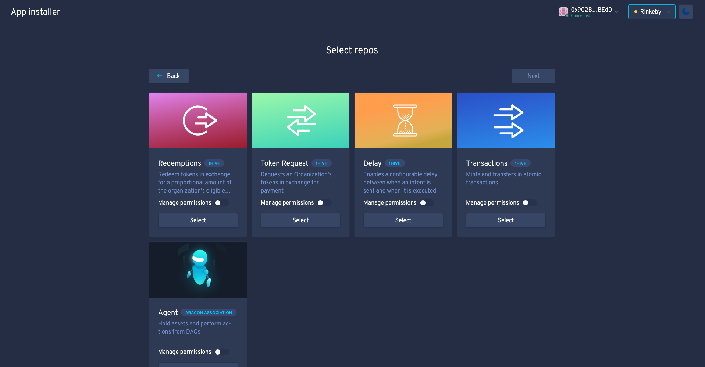

## DAO app installer

Basic UI to enable users to install apps to their DAO in an easily accessible way.

<a href="https://installer.1hive.org"></a>

**Currently available apps:** 

- [Redemptions](https://github.com/1Hive/redemptions-app)  
- [Token Request](https://github.com/1Hive/token-request-app) 
- [Delay](https://github.com/1Hive/delay-app) 
- [Transactions](https://github.com/1Hive/transactions-app/) 
- [Agent](https://github.com/aragon/aragon-apps/tree/master/apps/agent)

:soon: Permission management

#### Try it out locally: 

1. Clone this repo
```
git clone https://github.com/1Hive/app-installer.git 
```

2. cd into the directory
```
cd app-installer
```

3. Install dependencies
```
npm install
```

4. Start installer 
```
npm start
```
